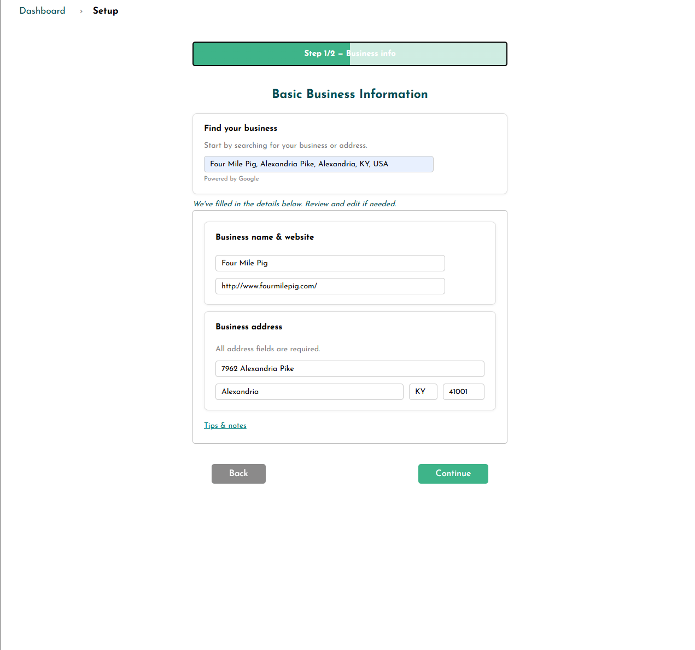
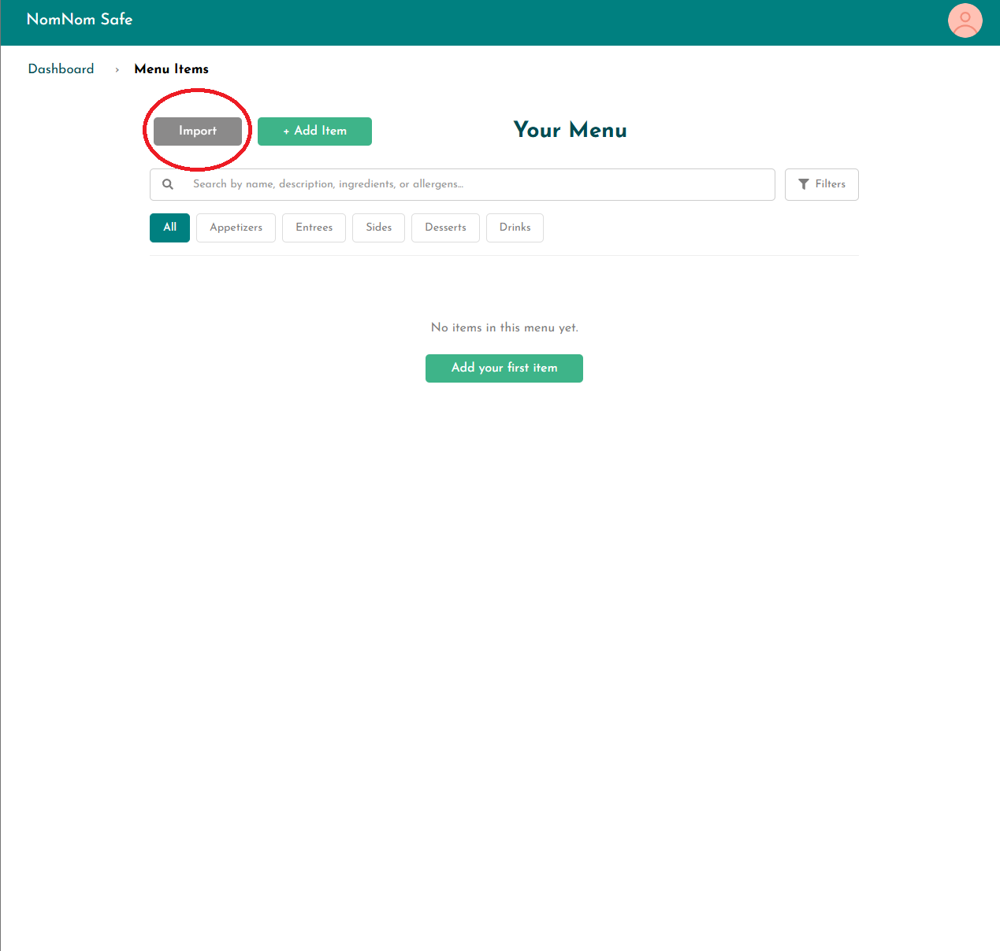
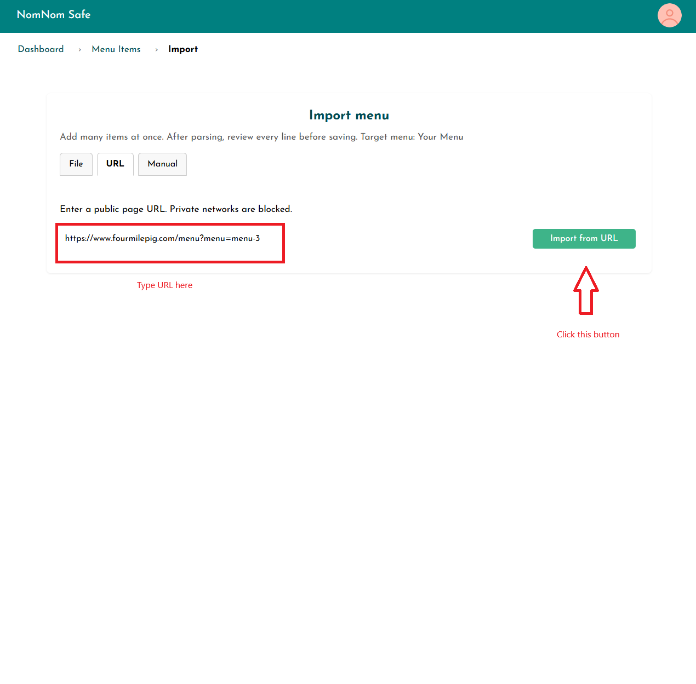
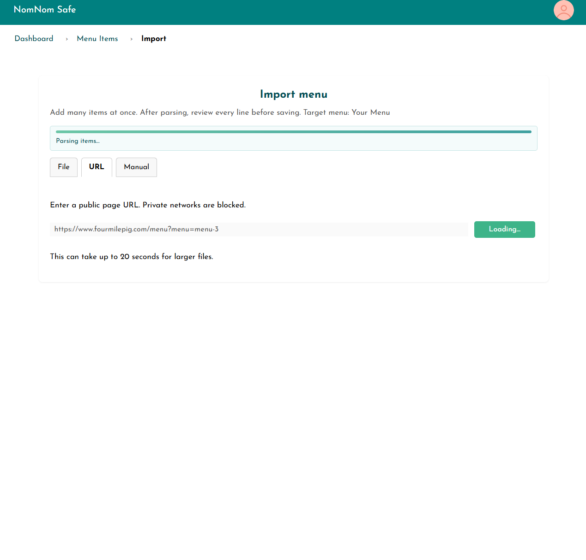
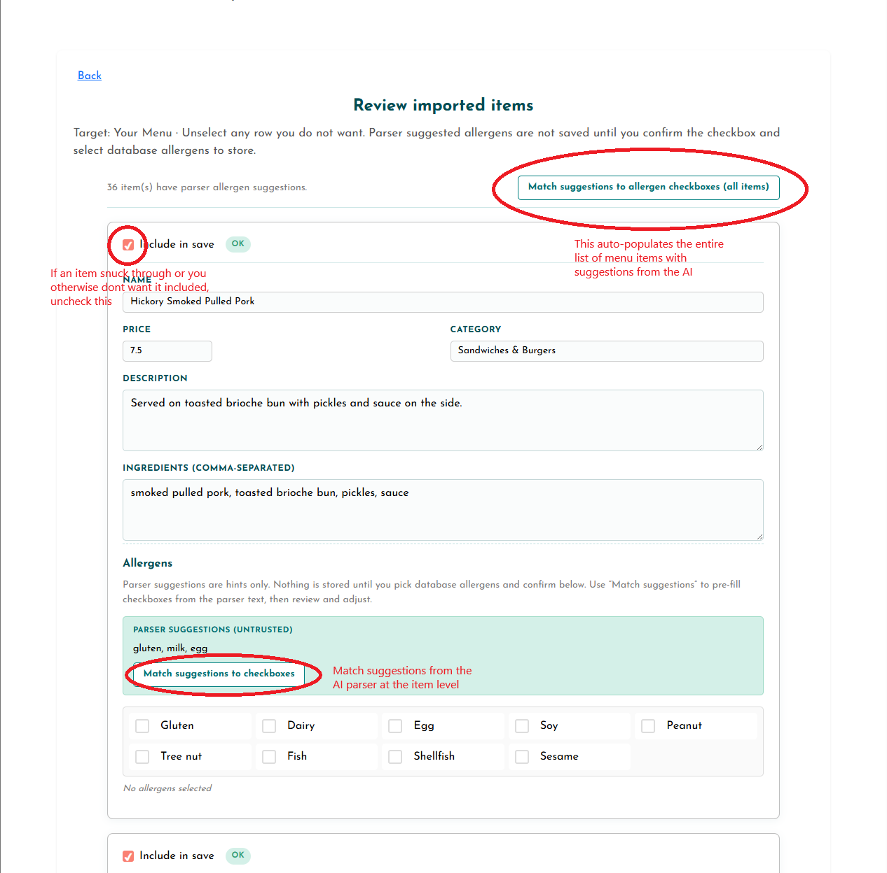
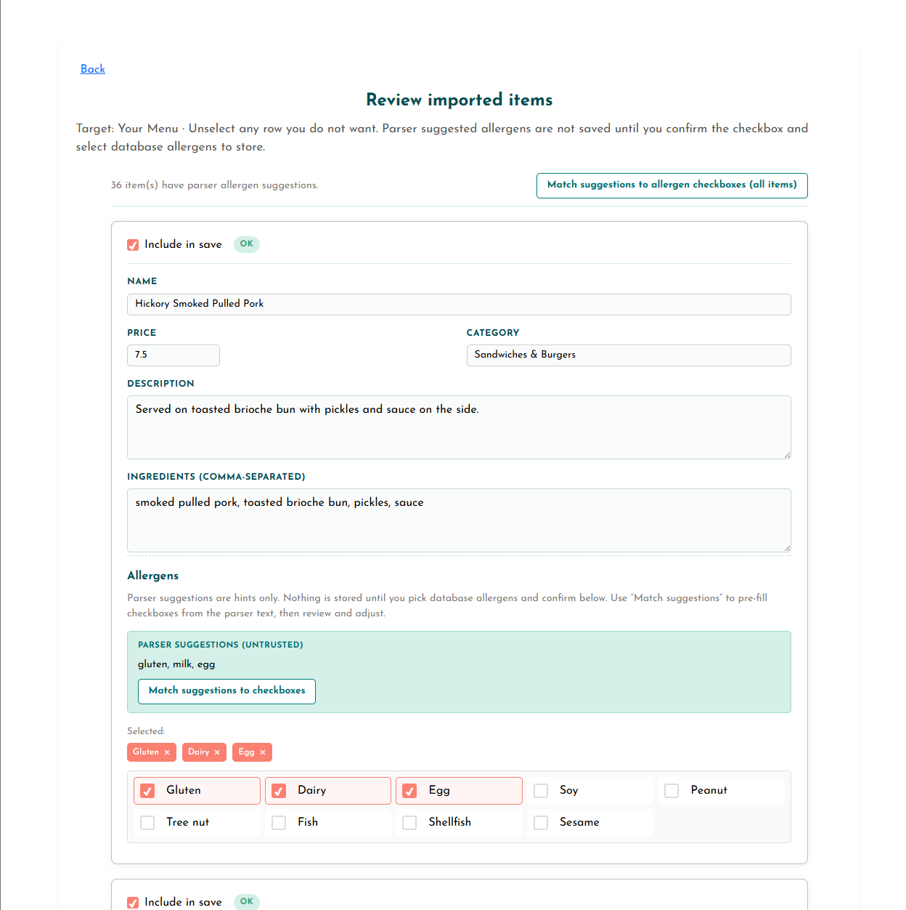
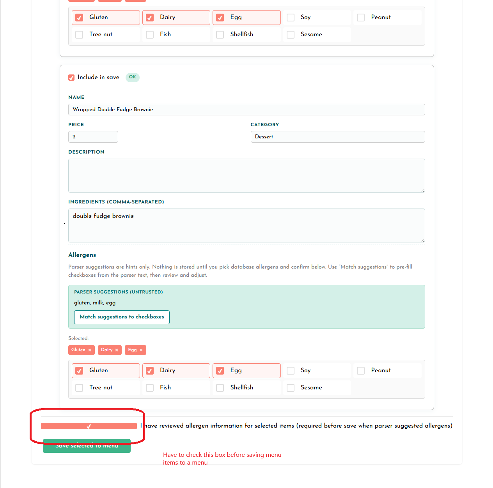
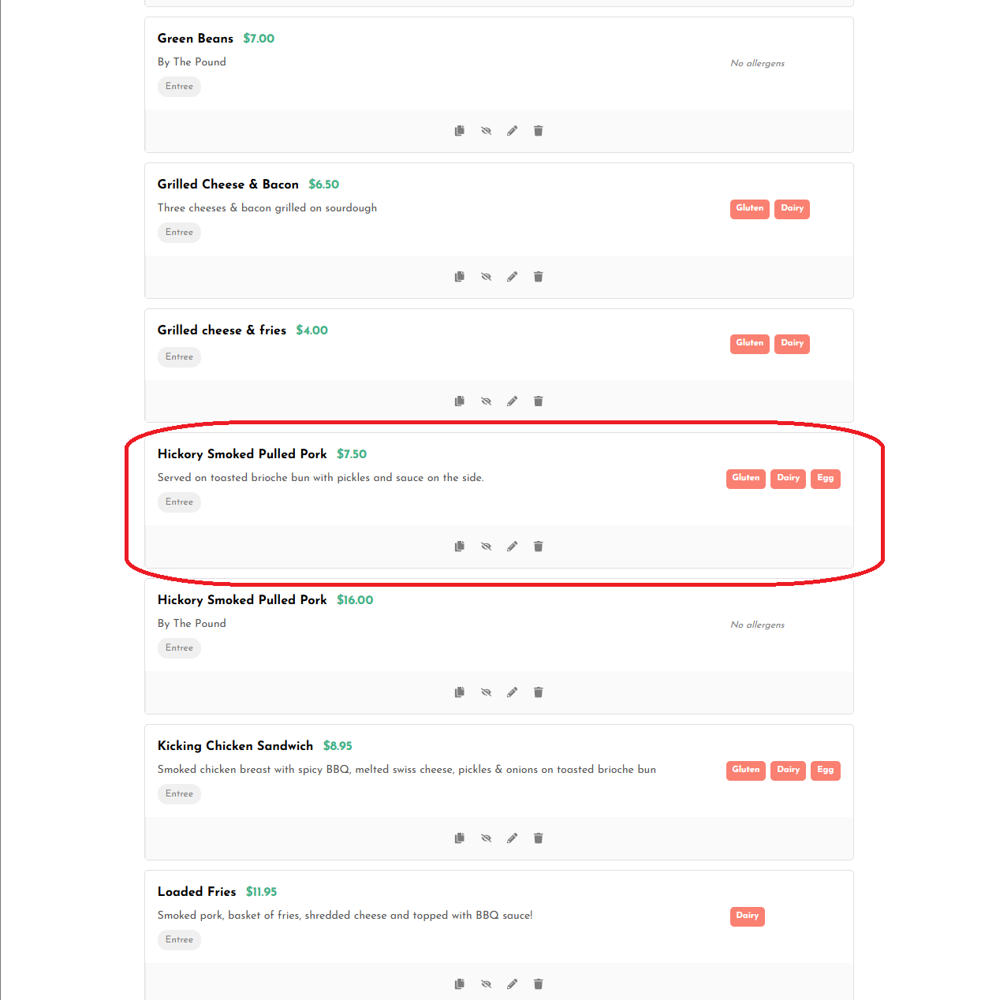

# NomNomSafe
## Final Presentation

Jeffrey Perdue  
ASE 485 Capstone

---

# What Problem Did I Solve?

- Restaurants need frequent menu updates, but sources are messy (PDF, DOCX, CSV, URL text).
- Manual entry is slow and error-prone.
- Allergen mistakes are safety-critical.
- The core problem: turn messy menu data into trustworthy, reviewable allergen-aware records.

---

# Why This Matters

- A wrong allergen signal can harm real people.
- Businesses need confidence and accountability in their menu data.
- "Unknown" should not be treated as "safe."
- The project goal was practical safety, not just feature completion.

---

# My Semester Approach

- Two-track plan:
  - **Track A (software):** build and validate business workflows.
  - **Track B (research):** build evidence-based allergen reasoning.
- Use AI as often as it made sense, and dynamically and critically assess how AI is used.
- Human confirmation remained mandatory for safety-relevant fields.

---

# Progress Since S1P

- Sprint 1 delivered a stable MVP foundation:
  - archived non-MVP features,
  - refactored front-end structure,
  - improved search/filter/sort,
  - improved onboarding.
- Sprint 2 expanded capability:
  - AI-assisted menu import/review/save,
  - stronger reliability/security controls,
  - ontology research completed (Phases 0-2).

---

# Project Results and Validation

- End-to-end flow works: import -> review -> confirm -> save.
- Multiple import paths supported (file and URL with fallback behavior).
- Reliability improvements added: quality gates, timeout/retry, rate limiting, clearer error handling.
- Validation completed via weekly checkpoints, regression checks, and demo readiness checklist.

---

# The System Prompt
const SYSTEM_PROMPT = `You are a menu data extraction assistant.
Your job is to parse raw text from restaurant menus and return structured JSON.

Return ONLY a valid JSON array. No markdown, no backticks, no explanation.
Each item must have exactly these fields:
{
  "name": "string (required — item name)",
  "description": "string (use empty string if not found)",
  "ingredients": ["array of strings — each ingredient as a separate string. Use empty array [] if not found."],
  "price": "number or null (numeric value only, no currency symbols)",
  "category": "string (infer from context, e.g. 'Appetizers', 'Entrees', 'Desserts', 'Drinks'. Use 'Uncategorized' if unknown.)",
  "possible_allergens": ["array of strings — allergen hints detected from explicit allergen statements OR clear ingredient terms in the same item text."]
}

---

CRITICAL RULES:
- ingredients MUST be a JSON array of strings, never a single string.
- possible_allergens should be conservative but useful:
  1) Include allergens explicitly stated in the source text (e.g., "contains milk").
  2) Also include allergens inferred from clear ingredient keywords in the same item text.
- Use only this controlled ingredient-to-allergen mapping:
  - milk, buttermilk, butter, cream, cheese, yogurt, whey, casein, ghee -> milk
  - wheat, flour, bread, pasta, noodle, semolina, durum, breadcrumbs -> gluten
  - egg, eggs, mayonnaise, aioli -> egg
  - peanut, peanuts, peanut butter -> peanuts
  - almond, walnut, pecan, pistachio, cashew, hazelnut, macadamia -> tree nuts
  - soy, soya, soybean, tofu, edamame, miso, tempeh -> soy
  - fish, salmon, tuna, cod, anchovy, sardine -> fish
  - shrimp, prawn, crab, lobster, crayfish, clam, mussel, oyster, scallop -> shellfish
  - sesame, tahini -> sesame
  - mustard -> mustard
  - celery -> celery
  - lupin -> lupin
  - sulfite, sulphite, sulfites, sulphites -> sulfites
- Never infer allergens beyond the mapping above.
- If allergen information is absent, ambiguous, or uncertain, return an empty array [] for that allergen.
- Return normalized allergen labels only (e.g., "milk", "gluten", "egg", "peanuts", "tree nuts", "soy", "fish", "shellfish", "sesame", "mustard", "celery", "lupin", "sulfites").`;

---

# How the System Double-Checks AI Imports

### Safe files, safe links, steady behavior
- You can import from **supported file types** (such as PDF, Word, or spreadsheet) up to a **reasonable file size**—not unlimited uploads.
- **Web links** are opened carefully: blocked risky hosts, timeouts, and rate limits help prevent abuse and long hangs.
- If a file or page has **no readable text** (for example a blank export or a scan with no text), you get a **clear message** instead of a mystery result.

### Cleaning up each suggested dish
- Every row must have a **dish name**; rows without a name are dropped.
- **Same name, same section twice?** Flagged as a duplicate so your list does not fill with clones.
- Long text is **trimmed** to sensible limits; messy ingredient lines are split into a **simple list** where possible.
- **Prices** like “$12.99” are turned into numbers when the system can read them; if it cannot, the price stays **empty**—the system does not guess a number.
- **Allergen hints** are lined up with **standard names** when they clearly match (for example “eggs” becomes egg).

### When to pause and review
- If **nothing usable** is left after cleanup, import **stops** and suggests another source or manual entry—**no empty shell pretending to be a menu**.
- If many dishes look **thin or vague** (missing details), you see a **low-confidence** heads-up so you know to read the list carefully.

### Nothing saved without your OK on allergens
- If the import suggested **possible allergens** for an item, you must **tick that you reviewed them** before that item can be saved. **Allergen data is never written without that step.**

---
# Demo (Live or Video)

### Demonstration Link

- Video: https://youtu.be/MfqT1rB7Udw

### What the demo shows

- Successful import from clean source.
- Human-confirmed allergen decisions before save.

---

---

---

---

---

---

---

---

---

# Learning with AI - Topic 1
## AI-Assisted Structured Data Extraction

- I learned AI can convert messy menu text into usable structured records.
- I also learned model output must be treated as untrusted input.
- Best result came from combining:
  - AI extraction for speed,
  - validation rules for quality,
  - human review for safety-critical decisions.

---

# Learning with AI - Topic 2

## Ontology Research Deliverables (Why They Matter)

### The real question

- "Can this dish be called safe for an allergen?"

### Why this needed research

- Menu wording is often incomplete.
- Staff language can be inconsistent.
- AI can sound confident even when evidence is missing.

### What the deliverables do

- Turn vague language into a clear evidence process.
- Separate "what we know" from "what we are guessing."
- Require proof before any safety claim is allowed.

---

# Learning with AI - Topic 2

## Documents Explained

| Deliverable | Plain-language outcome |
|---|---|
| **R3.1 - Failure Taxonomy** | Identified common unsafe reasoning patterns (for example, treating "not listed" as "safe"). |
| **R3.2 - Evidence Requirements** | Defined the minimum evidence needed before a conclusion can be trusted. |
| **R3.3 - Core Exposure Model** | Built a simple state model (including **Unknown**) with a strict rule for when "safe" is allowed. |
| **R3.4 - Scenario Test Suite** | Validated the model on 18 realistic food-service scenarios to confirm behavior under ambiguity. |
| **R3.5 - Communication Layer** | Mapped real menu/staff/disclaimer language into structured evidence without changing the core safety rule. |

### Bottom line

- The research produced a reusable safety framework that supports AI assistance while protecting against false confidence.

---

# Issues I Faced and How I Solved Them

- **Scope pressure:** solved by archiving non-MVP work and keeping a clear priority order.
- **Safety ambiguity:** solved by formal reasoning rules plus mandatory human confirmation.
- **Late-stage risk:** solved by a Week 14 scope freeze and explicit known limitations.

---

# Public Artifacts and Evidence

- Canvas page contains work presented at NKU Celebration of Research Thursday April 23.
- Presentation led by project collaborator Anna Dinius

---

# Closing

## Q and A
