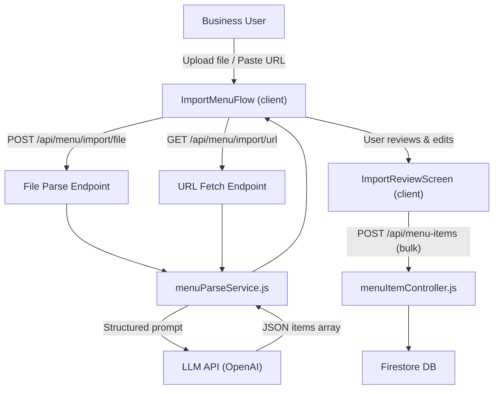

# Sprint 2 Plan — NomNomSafe Business-Side

**ASE 485 – Capstone Project**
Jeff Perdue

Sprint 2: Weeks 10–15 (3/16–4/26/2026)

---

## Context & Inherited State

Sprint 1 (Weeks 4–7) delivered a stable MVP: archived non-MVP code, front-end refactor, search/filter/sort, and structured business onboarding. The current menu side of the app (`MenuItemsPage`, `AddMenuItem`, `MenuItemPanel`) is functional for manual item management but has no bulk import capability. Multiple-menu support is already stubbed in `MenuDashboard` behind `/* Non-MVP Feature */` comments.

---

## Three Sprint Tracks

- **Track A** — Menu Management UX + AI-Assisted Import
- **Track B** — Food Allergen Ontology Research (Phases 0–2)
- **Track C** — Celebration of Student Research (April 23)

---

## Week-by-Week Schedule

### Week 10 (3/16–3/22) — Foundation & Sprint Setup

**Track A**

- Sprint 2 SRS: write actor-goal requirements for all features (targeting 20+ requirements)
- UX audit of existing menu item flows; identify friction points in AddMenuItem and MenuItemPanel
- Architecture decision: choose LLM provider (OpenAI recommended), get API key, add `OPENAI_API_KEY` to `server/.env` and `.env.example`
- Minor UX polish to existing manual add/edit/delete flows (inline feedback, accessibility gaps)

**Track B**

- Begin Phase 0: collect 20–30 allergen-related prompts across diverse scenarios
- Run prompts against baseline LLMs; record raw responses

**Milestone:** Sprint 2 scope is documented; LLM API access confirmed; Phase 0 data collection underway.

---

### Week 11 (3/23–3/29) — Import Infrastructure

**Track A**

- Server: install and wire file parsing libraries
  - PDF: `pdf-parse`
  - CSV: `csv-parse`
  - DOCX: `mammoth`
- New server endpoint: `POST /api/menu/import/file` — accepts multipart file upload, extracts text, sends to LLM, returns structured JSON array of menu items
- LLM parsing service (`server/src/services/menuParseService.js`): structured prompt returning `[{ name, description, ingredients, price, category, possible_allergens[] }]`
- API client wired in `client/src/api/index.js`

**Track B**

- Complete Phase 0: categorize all LLM failures into the taxonomy (overconfident safety, omission-as-absence, cross-contact blindness, preparation-context blindness)
- Produce: **Allergen Safety Failure Taxonomy** doc + **Structural Evidence Requirements** doc

**Milestone:** Server can receive a file, parse it, and return structured items. Phase 0 deliverables complete.

---

### Week 12 (3/30–4/5) — Import Review UI + URL Parsing

**Track A**

- New `ImportMenuFlow` component: a modal or dedicated page with three entry tabs
  - **File upload** (PDF, CSV, DOCX via drag-and-drop or file picker)
  - **Paste URL** (best-effort fetch; see feasibility note below)
  - **Manual** (existing Add Item flow, accessible from the same entry point)
- Import review screen: displays a list of parsed items, each with editable fields (name, description, ingredients, price, category, allergens). Possible allergens surfaced by the LLM are pre-checked but require explicit user confirmation.
- User can deselect items they don't want to import, edit any field, then bulk-save all selected items

**URL Parsing Feasibility Note:** A server-side `GET /api/menu/import/url` endpoint will fetch the page HTML using `axios` + `cheerio` for text extraction, then pass the extracted text to the LLM. This is best-effort — works reliably for static restaurant sites, may fail for JS-heavy SPAs or sites that block scrapers. The UI will surface a graceful fallback ("We couldn't read that page — try uploading a file instead").

**Track B**

- Begin Phase 1: draft the Core Exposure-State Ontology
  - Define: FoodItem, Ingredient, Substance, Allergen, PreparationContext, CrossContactSource, ExposureState
  - Exposure states: ConfirmedPresent, ConfirmedAbsent, PotentiallyPresent, Unknown
  - Write the Safety Inference Principle

**Milestone:** End-to-end file import works (upload → LLM parse → review → save to DB). URL parsing implemented with graceful fallback. Phase 1 ontology draft started.

---

### Week 13 (4/6–4/12) — Polish + Phase 1 Complete + Stretch

**Track A**

- Import flow hardening: error states, LLM timeout/failure handling, file size/type validation, empty parse results
- URL parsing edge cases resolved
- Stretch: un-archive multiple-menu support in `MenuDashboard` — activate the commented-out Add/Delete menu code and wire it up cleanly

**Track B**

- Complete Phase 1: apply ontology to 15–20 stress-test scenarios (shared fryer, oil ambiguity, "may contain," missing prep context)
- Produce: **Phase 1 Deliverables** — conceptual ontology doc, exposure-state framework, scenario test suite, draft backend-friendly output structure

**Milestone:** Import feature is functionally complete. Phase 1 ontology fully documented.

---

### Week 14 (4/13–4/19) — Presentation Prep + Phase 2

**Track A**

- Final UX polish and bug fixes across all Sprint 2 features
- Demo walkthrough rehearsal: business onboarding → import menu via file/URL → review allergens → save

**Track B**

- Phase 2 — Epistemic Extension: model how allergen risk is communicated; add Mention, Omission, Disclaimer, RoleType, CertaintyLevel, Scope to the ontology
- Map real-world menu language patterns onto exposure states

**Track C**

- Draft poster for NKU Celebration of Student Research
- Draft slide deck covering: problem domain, Sprint 1 + 2 features, ontology research, live demo plan
- Content sections: system overview, import/parsing flow, allergen ontology, evidence-based safety principle

**Milestone:** Poster/slides draft complete. Phase 2 ontology drafted. App demo-ready.

---

### Week 15 (4/20–4/26) — Celebration + Wrap-up

**Track C**

- Finalize poster and slides (April 22)
- **April 23 — NKU Celebration of Student Research**: present live demo + poster

**All Tracks**

- Post-celebration documentation: update README with Sprint 2 scope and outcomes
- Sprint 2 retrospective

---

## Feature Summary & Actor-Goal Requirements

### Feature 1 — Manual Menu Management UX

- **R1.1** — As a **business user**, the system shall provide a seamless, validated form for adding a new menu item (name, description, ingredients, price, category, allergens, availability) so that items can be added without ambiguity.

- **R1.2** — As a **business user**, the system shall allow editing all menu item fields inline without leaving the menu page so that updates require minimal navigation.

- **R1.3** — As a **business user**, the system shall confirm before deleting a menu item and provide clear feedback on success or failure so that accidental deletions are prevented.

- **R1.4** *(stretch)* — As a **business user**, the system shall allow creating and deleting named menus so that businesses with multiple distinct menus can organize items accordingly.

---

### Feature 2 — AI-Assisted Menu Import

- **R2.1** — As a **business user**, the system shall accept a file (PDF, CSV, DOCX) and extract its text content for AI-assisted parsing so that existing menu documents can be imported without manual re-entry.

- **R2.2** — As a **business user**, the system shall accept a URL and attempt to fetch and parse the menu page so that business users can import directly from their existing web presence.

- **R2.3** — As a **business user**, the system shall present parsed items in a reviewable list before any data is saved so that the user retains full control over what enters the system.

- **R2.4** — As a **business user**, the system shall allow editing any parsed item field (name, description, ingredients, price, category, allergens) during review so that errors or gaps from parsing can be corrected before import.

- **R2.5** — As a **business user**, the system shall allow deselecting individual parsed items from the import so that unwanted or duplicate items are not saved.

- **R2.6** — As a **business user**, the system shall highlight AI-detected possible allergens per item for explicit human confirmation before saving so that allergen data is never assumed without review.

- **R2.7** — As a **system**, the system shall produce a clear error message with a fallback option (manual entry) when LLM parsing fails or a URL cannot be fetched so that import failures do not block the user.

- **R2.8** — As a **system**, the system shall never save AI allergen suggestions without explicit user confirmation so that business users remain responsible for all safety-relevant data.

---

### Feature 3 — Ontology Research (Phases 0–2)

- **R3.1** — As a **researcher**, the system shall produce an Allergen Safety Failure Taxonomy documenting categories of unsafe LLM reasoning so that structural gaps are clearly identified.

- **R3.2** — As a **researcher**, the system shall produce a Structural Evidence Requirements document identifying what structured knowledge would have prevented each recorded failure.

- **R3.3** — As a **researcher**, the system shall produce a Core Exposure-State Ontology document defining all Phase 1 concepts and the Safety Inference Principle.

- **R3.4** — As a **researcher**, the system shall produce a scenario test suite of 15–20 cases validating that the ontology permits justified inference and blocks unjustified inference.

- **R3.5** — As a **researcher**, the system shall produce a Phase 2 Epistemic Extension document modeling how allergen risk communication maps onto structural exposure states.

---

## Architecture — Import Pipeline

**New server files:**

- `server/src/services/menuParseService.js` — LLM integration + prompt design
- `server/src/controllers/menuImportController.js` — file/URL import endpoints
- `server/src/routes/menuImportRoutes.js`

**New client files:**

- `client/src/components/menuItems/ImportMenuFlow/ImportMenuFlow.jsx`
- `client/src/components/menuItems/ImportReviewScreen/ImportReviewScreen.jsx`

---

## Presentation Deliverables (Track C)

- Poster: system overview, import flow, allergen safety model, evidence-based design principle
- Slide deck: same content in presentation format with a live demo walkthrough
- Demo script: sign up → onboard business → import a sample menu file → review allergens → save → view menu items page

---

## Sprint 2 Milestones Summary

| Week | Dates | Milestone |
|------|-------|-----------|
| 10 | 3/16–3/22 | Sprint 2 scope documented; LLM API access confirmed; Phase 0 data collection underway |
| 11 | 3/23–3/29 | Server parses files and returns structured items; Phase 0 deliverables complete |
| 12 | 3/30–4/5 | End-to-end file import works; URL parsing with fallback in place; Phase 1 ontology draft started |
| 13 | 4/6–4/12 | Import feature functionally complete; Phase 1 ontology fully documented |
| 14 | 4/13–4/19 | Poster/slides draft ready; Phase 2 ontology drafted; app demo-ready |
| 15 | 4/20–4/26 | **April 23** — NKU Celebration of Student Research; sprint retrospective complete |

---

## Risk Register

| Risk | Mitigation |
|------|------------|
| LLM API latency / cost | Cache parse results server-side; set a reasonable token limit on submitted text |
| URL scraping reliability | Scope as best-effort with explicit UX fallback; do not block the feature on this |
| File parsing edge cases | Test against real restaurant menus in Week 11; handle encoding and layout issues early |
| Ontology scope creep | Phases 0–2 are documentation/research artifacts, not production code — timebox each phase to ~1 week |
| Multiple menus stretch | Activate only if Week 13 polish is complete; otherwise defer to Sprint 3 |
